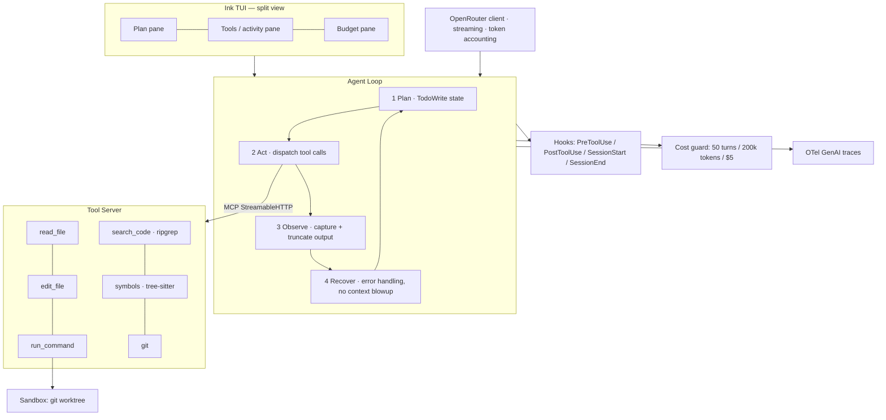

# terminal-native-coding-agent

> A terminal-native AI coding agent, built from scratch — the **plan → act → observe → recover**
> loop, MCP tools, sandboxed execution, safety hooks, and hard cost ceilings that separate a
> production coding agent from a toy.

<p>
  
  
  
  
</p>

This project implements the architecture behind 2026-era coding tools (Claude Code, Cursor, and
friends). The premise, borrowed from the capstone it follows: **the hard part isn't the model call —
it's the tool loop, the sandbox, and the cost ceiling.**

> **Status: in progress.** Being built in the open, one phase per day over ~a week. See the
> [roadmap](#roadmap) for what's landed and what's next.

---

## Architecture

Five cooperating layers:



| Layer | Responsibility |
| --- | --- |
| **Plan** | A typed, TodoWrite-style plan the model rewrites each turn; journaled so a crash can resume. |
| **Act** | Dispatches tool calls (read, edit, run, search, symbols, git) over MCP StreamableHTTP. |
| **Observe** | Captures tool output and **truncates aggressively** — the "ripgrep returned 8 MB" problem. |
| **Recover** | Handles tool errors and context poisoning without infinite loops or context explosion. |
| **Hooks** | `PreToolUse` / `PostToolUse` / `SessionStart` / `SessionEnd` extension points for safety & cost. |

## Tech stack

- **Runtime:** Bun 1.2+ with a React-in-the-terminal TUI (Ink).
- **Models:** any OpenRouter model, selected via a small role-based registry (`default` / `reasoning` / `fast`).
- **Tools:** ripgrep (search), tree-sitter (symbols), git, and sandboxed shell execution.
- **Sandbox:** local-first — an isolated **git worktree** per task; a cloud adapter (E2B/Daytona) is a documented drop-in.
- **Observability:** OpenTelemetry with GenAI semantic conventions (console exporter; Langfuse optional).

## Quickstart

```bash
# 1. Install Bun (https://bun.sh) if you don't have it
curl -fsSL https://bun.sh/install | bash

# 2. Install dependencies
bun install

# 3. Configure your OpenRouter key
cp .env.example .env
# then edit .env and set OPENROUTER_API_KEY

# 4. Smoke-test the model round-trip
bun run ask "explain the plan/act/observe/recover loop in one paragraph"

# 5. Launch the interactive TUI (plan / activity / budget split-view)
bun run start
```

`bun run start` opens the split-view terminal UI: type a task at the `❯` prompt, watch it
stream into the activity pane, and press Ctrl-C to cancel an in-flight turn (or exit when idle).
The live model + tool loop is wired in behind this same interface from Day 4.

## Configuration

All configuration is via environment variables (see [`.env.example`](.env.example)):

| Variable | Default | Purpose |
| --- | --- | --- |
| `OPENROUTER_API_KEY` | — | **Required.** Your OpenRouter API key. |
| `TNCA_MODEL` | `default` | Model role: `default`, `reasoning`, or `fast` (mapped in `src/config/models.ts`). |
| `TNCA_MODEL_ID` | — | Raw OpenRouter slug override (e.g. `anthropic/claude-sonnet-4.5`). |
| `TNCA_MAX_TURNS` | `50` | Per-task turn ceiling (enforced from Day 8). |
| `TNCA_MAX_TOKENS` | `200000` | Per-task token ceiling. |
| `TNCA_MAX_USD` | `5` | Per-task dollar ceiling. |

## Tools

The agent reaches the codebase through six tools, served over **MCP StreamableHTTP** (`src/mcp`)
and dispatched by the model in the act→observe loop. Every tool result passes through
[output truncation](src/tools/truncate.ts) so one noisy command can't poison the context window.

| Tool | What it does |
| --- | --- |
| `read_file` | Line-numbered file reads with optional line-range slicing. |
| `edit_file` | Create/overwrite, or replace an exact (unique) string. |
| `search_code` | ripgrep over the repo; results capped and made relative. |
| `symbols` | tree-sitter outline (functions/classes/types) — 30+ languages. |
| `run_command` | Sandboxed `bash -c` with a timeout and output cap. |
| `git` | Allowlisted git subcommands (no destructive/remote ops). |

Paths are contained to the working directory, and the model manages its own plan via an
`update_plan` control tool. When no API key is set, the TUI runs an offline stub so it still works.

## Development

```bash
bun run typecheck   # tsc --noEmit
bun run lint        # biome check
bun run format      # biome format --write
bun test            # unit tests
```

## Roadmap

Built one phase per day. Checked = landed.

- [x] **Day 1 — Foundations:** Bun scaffold, config + model registry, streaming OpenRouter client, `ask` smoke test.
- [x] **Day 2 — TUI scaffold:** Ink split-view (plan / activity / budget) + prompt input & Ctrl-C cancellation.
- [x] **Day 3 — Plan state:** zod-typed TodoWrite state, journaled to `.agent/session-*.json`, restored on restart after a crash.
- [x] **Day 4 — Tools over MCP:** six core tools on an MCP StreamableHTTP server, real model tool-calling in the act→observe loop, aggressive output truncation.
- [ ] **Day 5 — Sandbox:** git-worktree isolation for edits & execution.
- [ ] **Day 6 — Hooks:** lifecycle hooks + safety policies.
- [ ] **Day 7 — Observability:** OTel GenAI spans + live token/cost accounting.
- [ ] **Day 8 — Cost control:** three-layer ceilings + recovery hardening.
- [ ] **Day 9 — Eval & PR:** 30-task eval vs baseline + auto-open GitHub PR.

## Acknowledgements

Built following Capstone 01 —
[Terminal-Native Coding Agent](https://aiengineeringfromscratch.com/lesson.html?path=phases/19-capstone-projects/01-terminal-native-coding-agent)
from *AI Engineering from Scratch*.

## License

[MIT](LICENSE) © Rushil Petrus
